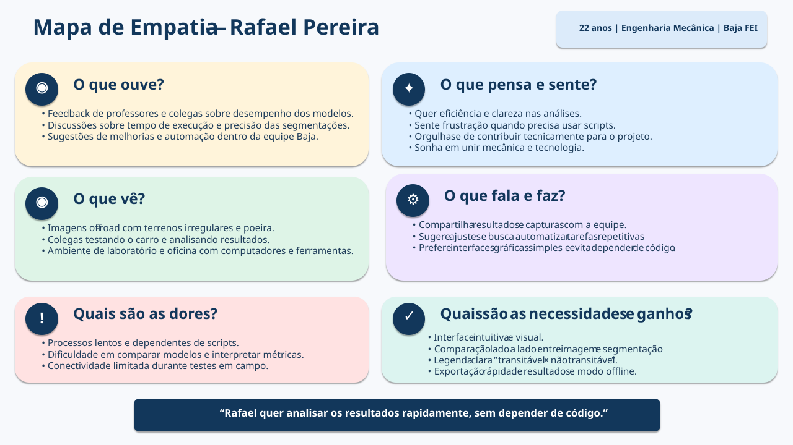

# Entrega 3 — Personas, mapa de empatia, contexto de uso e jornada

**Data:** {{23/09/2026}}  
**Status:** 🟨 Em andamento  
**Responsabilidade:** 1 persona por integrante; 1 mapa de empatia, 1 contexto de uso consolidado e 1 jornada por equipe (salvo orientação diferente do docente).

## Objetivo da atividade

Representar grupos de usuários de forma útil para decisões de design. Persona não é personagem decorativo: suas características devem alterar requisitos, prioridades, linguagem, fluxos ou critérios de avaliação.

## Atenção a projetos técnicos

Em TCCs sem interface original, a persona pode representar um **profissional que se apropria da contribuição técnica**: DBA, analista, cientista de dados, administrador, pesquisador, técnico, operador, gestor ou especialista de domínio.

Não escolha um perfil apenas porque “parece combinar” com a tecnologia. Explique **qual objetivo esse perfil teria e qual parte da contribuição do TCC produziria valor para ele**. Se ainda for hipótese, mantenha como hipótese/proto-persona a validar.

Também considere papéis diferentes quando houver tarefas distintas, por exemplo:

- operador que executa análises;
- administrador que configura e gerencia permissões;
- especialista que interpreta resultados;
- gestor que consulta relatórios e decide;
- auditor que revisa histórico.

## Entradas da Entrega 1

Antes de criar personas, retome os tipos de usuários, características relevantes, objetivos e hipóteses registradas na Entrega 1. A persona **não deve transformar uma hipótese inicial em fato por meio de uma história fictícia**.

| Item da Entrega 1 | Status inicial | Evidência disponível agora | Como será tratado nesta entrega |
|---|---|---|---|
| {{usuário/objetivo/característica/H01...}} | F / H / ? | {{...}} | incorporar / manter como hipótese / descartar / investigar |

## 1. Personas

### Persona P01 — Rafael Pereira

**Autor(a):** {{Tiago — 22.123.017-0}}  
**Tipo:** primária 
**Base de evidências:** observação  
**Hipóteses da Entrega 1 relacionadas:** {H02, H03 ou H04}

| Campo | Descrição |
|---|---|
| Faixa etária / contexto relevante | Rafael tem 22 anos, cursa Engenharia Mecânica na FEI e é membro ativo da equipe Baja FEI, participando de testes de campo e manutenção nos fins de semana. Trabalha na mecânica do pai desde os 15 anos, o que despertou seu interesse pelo Baja. No ensino médio fez curso técnico e participou de projetos práticos que integravam mecânica e tecnologia, o que o deixou curioso por automações e integrações entre sensores e software.   |
| Ocupação/papel | Mecânico |
| Conhecimento do domínio | Bom conhecimento prático de off‑road, dinâmica do veículo e noções básicas de visão computacional. |
| Experiência tecnológica | Intermediária, confortável com scripts em Python (projetos de automação no ensino técnico), mas não é desenvolvedor prefere resolver tarefas por interface a escrever/depurar código toda vez. |
| Objetivos |  Validar rapidamente se a segmentação identifica corretamente áreas transitáveis e gerar evidências visuais para reuniões da equipe e relatórios do Baja. |
| Necessidades | Visualização lado a lado (original × segmentação) e exportar imagens e relatórios simples. |
| Dores/frustrações | Dependência de scripts para cada visualização, perda de tempo quando o código quebra e o fato do ter que gerar relatórios manuais. |
| Motivadores | Entregar resultados rápidos e confiáveis para a equipe e automatizar tarefas repetitivas. |
| Restrições/acessibilidade | Prefere atalhos de teclado e workflows com poucos cliques. |
| Ambiente típico de uso | Laboratório da FEI (análises detalhadas) e espaco off-road dentro da FEI. |
| Comportamentos relevantes | Testa várias imagens em sequência/vídeos, salva versões e anota observações e compartilhamento dos resultados entre a equipe. |

**Decisões de design influenciadas por P01:**

**1. Tela principal: comparação lado a lado com controles de opacidade e zoom**
- **Descrição:** imagem original e máscara de segmentação exibidas simultaneamente; controles de opacidade e zoom integrados.
- **Justificativa:** permite inspeção rápida de detalhes de terrenos irregulares sem trocar de tela, atendendo ao objetivo de validar rapidamente áreas transitáveis.

**2. Legenda com cores consistentes e destaque textual "transitável × não transitável"**
- **Descrição:** paleta fixa entre execuções; rótulo textual sempre visível e de alto contraste.
- **Justificativa:** reduz carga cognitiva ao testar várias imagens em sequência e evita reinterpretação da legenda a cada execução.

**3. Painel de comparação de modelos com métricas essenciais e gráficos rápidos**
- **Descrição:** exibe IoU por classe, acurácia global e gráficos comparativos simples (barras/linhas); números acompanhados de visualização gráfica.
- **Justificativa:** facilita comparar variantes do DeepLabv3+ e gera evidências visuais para reuniões, sem exigir conhecimento avançado em ML.

**4. Fluxo sem código: upload por arrastar e soltar, processamento com um clique, histórico e exportação PNG/PDF**
- **Descrição:** upload intuitivo, botão único para executar a segmentação, lista de execuções anteriores e exportação direta de imagens/relatórios.
- **Justificativa:** elimina a dependência de scripts, reduz fricção operacional e acelera a geração de evidências para a equipe.

**5. Modo offline, mensagens de erro claras, atalhos de teclado e presets de visualização**
- **Descrição:** operação local quando necessário; mensagens orientam solução rápida; atalhos e presets para visualizações frequentes.
- **Justificativa:** atende à conectividade limitada em campo e à preferência por workflows rápidos, mitigando problemas quando não há suporte técnico disponível.

> Repita para P02, P03... Cada integrante deve produzir ao menos uma persona.

### Síntese das personas

Explique diferenças entre os perfis e qual persona é prioritária. Evite personas duplicadas que só mudam nome/foto.

## 2. Mapa de empatia — equipe

**Persona escolhida:** **Rafael Pereira**
**Justificativa:** Rafael é o usuário primário do sistema de visualização de segmentação semântica. Ele representa o perfil de estudante de engenharia mecânica da equipe Baja FEI, que precisa validar rapidamente resultados de modelos sem depender de código.

<!--Documente também em texto: o que vê; ouve; diz/faz; pensa/sente; dores; ganhos. Diferencie **evidência** de **hipótese**. -->

| Dimensão | Descrição | Evidência |
|---|---|---|
| O que pensa e sente | Quer eficiência e clareza nas análises; sente frustração quando precisa recorrer a scripts ou quando o sistema demora a processar; valoriza soluções práticas e visuais; sente orgulho em contribuir tecnicamente para o projeto Baja. | H01; H02 |
| O que vê | Imagens off‑road com terrenos irregulares e poeira; colegas testando o carro e discutindo resultados; dashboards e planilhas com métricas; ambiente de laboratório e oficina. | H03; H04 |
| O que ouve | Feedback de professores e colegas sobre desempenho dos modelos; discussões sobre melhorias no sistema; comentários sobre tempo de execução e precisão das segmentações. | H01; H04|
| O que fala e faz | Compartilha resultados e capturas com a equipe; sugere ajustes; busca automatizar tarefas repetitivas; usa ferramentas gráficas sempre que possível; evita depender de código. | H04; H05|
| Dores | Processos lentos e dependentes de scripts; legendas confusas; dificuldade de comparar modelos; falta de conectividade em campo. | H01; H05 |
| Necessidades / ganhos | Interface intuitiva e visual; comparação lado a lado; legenda clara "transitável × não transitável"; exportação rápida de resultados; modo offline para uso em campo. | H01|

## 3. Contexto de uso — consolidação

| Dimensão | Descrição | Implicação de design |
|---|---|---|
| Usuários | {{...}} | {{...}} |
| Tarefas | {{...}} | {{...}} |
| Equipamentos | {{...}} | {{...}} |
| Ambiente físico | {{...}} | {{...}} |
| Ambiente social/organizacional | {{...}} | {{...}} |
| Papéis/permissões/governança | {{...}} | {{...}} |
| Volume de dados/histórico | {{...}} | {{...}} |

## 4. Jornada do usuário — equipe

**Persona:** **Rafael Pereira**
**Objetivo da jornada:** Validar rapidamente se a segmentação identifica corretamente áreas transitáveis, comparar modelos e gerar evidências visuais para a equipe.  
**Início e fim da jornada:** Do momento em que Rafael coleta imagens em campo até a exportação dos resultados para discussão em reunião.

| Etapa | Situação/ação | Objetivo | Pensamento/emoção | Dor | Oportunidade de design | Evidência |
|---|---|---|---|---|---|---|
| 1 | Rafael coleta imagens em campo off-road | Obter dados reais para validar segmentação | "Preciso garantir que o modelo funciona em terreno real" | Conectividade limitada | Modo offline | Fotos capturadas no Baja |
| 2 | Faz upload das imagens por arrastar e soltar | Iniciar processamento sem depender de código | "Quero rapidez, sem scripts" | Fricção com reexecução manual | Fluxo sem código, botão único | Histórico de execuções |
| 3 | Compara imagem original e máscara lado a lado | Validar áreas transitáveis vs não transitáveis | "Consigo ver claramente os obstáculos" | Troca de telas atrapalha | Comparação com opacidade/zoom | Visualização simultânea |
| 4 | Consulta legenda fixa com cores consistentes | Interpretar rapidamente classes críticas | "Não preciso reaprender a legenda" | Cores variando entre execuções | Legenda fixa + texto "transitável × não transitável" | Paleta consistente |
| 5 | Analisa painel de métricas (IoU, acurácia) com gráficos | Comparar modelos e versões | "Entendo melhor com gráficos simples" | Métricas cruas difíceis de interpretar | Painel visual com gráficos rápidos | Comparação DeepLabv3+ |
| 6 | Exporta resultados em PNG/PDF para reunião | Compartilhar evidências com equipe | "Agora posso mostrar para todos" | Perda de tempo em conversões | Exportação direta | Arquivos prontos para reunião |

<!-- A jornada pode incluir etapas **antes, durante e depois** do uso do produto. Não transforme a jornada em lista de telas. -->

## Síntese

As necessidades e objetivos que devem aparecer nos cenários e tarefas seguintes são: 
* Validação rápida da segmentação em campo.
* Interface sem código para reduzir fricção.
* Visualização clara e consistente (lado a lado, legenda fixa).
* Comparação de modelos com métricas gráficas.
* Exportação simples de resultados.

## Checklist

- [ ] Existe pelo menos uma persona por integrante.
- [ ] As personas não são apenas diferenças demográficas superficiais.
- [ ] Está claro o que é dado real e o que é hipótese/proto-persona.
- [ ] A persona não “validou por ficção” uma hipótese da Entrega 1; afirmações continuam marcadas como hipótese quando não há evidência.
- [ ] Objetivos e dores têm consequência para o design.
- [ ] Contexto de uso está coerente com a Entrega 1.
- [ ] Em TCC sem interface original, a persona possui relação explícita com a contribuição técnica.
- [ ] Papéis administrativos, técnicos e decisórios só foram criados quando possuem objetivos/tarefas diferentes.
- [ ] Jornada possui etapas, dores e oportunidades e não é apenas wireflow.
- [ ] IDs das personas foram adicionados à rastreabilidade.
